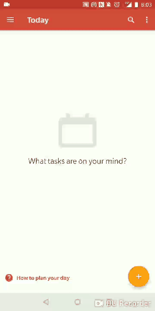

# unofficial-todoist-gmail-addon
Sometimes you want to want to convert emails inside your phone's gmail app (not just web browser) into a todoist task. 
This gmail add-on helps you do it!

# How to install the add-on
This addon is not yet published on the gmail store, but you may install it as an unpublished addon. To do so, follow the steps in the link below:
https://developers.google.com/gmail/add-ons/how-tos/install-unpublished

When you get to the part where you need a deployment ID, use mine:
`Deployment ID: AKfycbyGG7RK0-Qg-79wI7QGuW2lPbBAIj_l0yEePpj9I3Ro`

Because this is currently still just a developer (unpublished) add-on, I need to whitelist your gmail address for to you be able to install it. Otherwise you may just get an `invalid add-on` error.

UPDATE (2018-11-02): Sadness for iOS gmail users! As of 2018-11-02 gmail-addons are not yet enabled on iOS. :(  

## Follow-up features
This is for sure a work in progress. Some of my next goals are:
1) make it so that once a gmail gets added as a task in todoist, if i click on a task, it can take me straight to the gmail thread
2) when i convert a task, if the task was already created from the same gmail and i just forgot that ihad done it, it prevents me from redundantly adding the same gmail as a task
3) allow user to set Due Date and Project and other attributes via the addon
